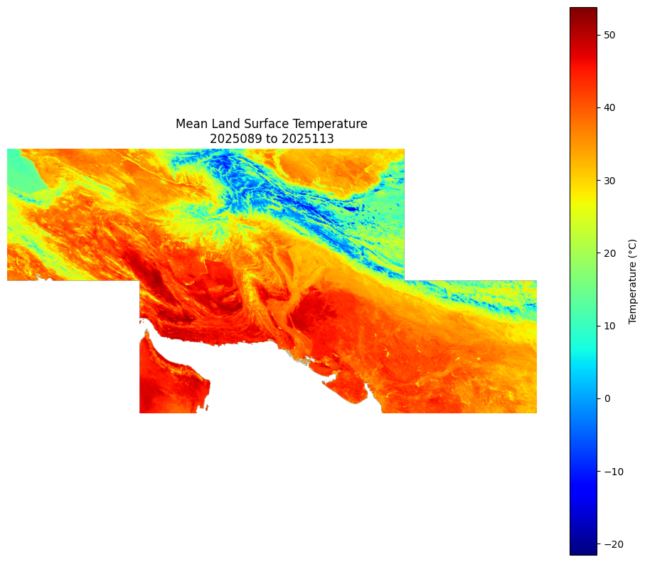
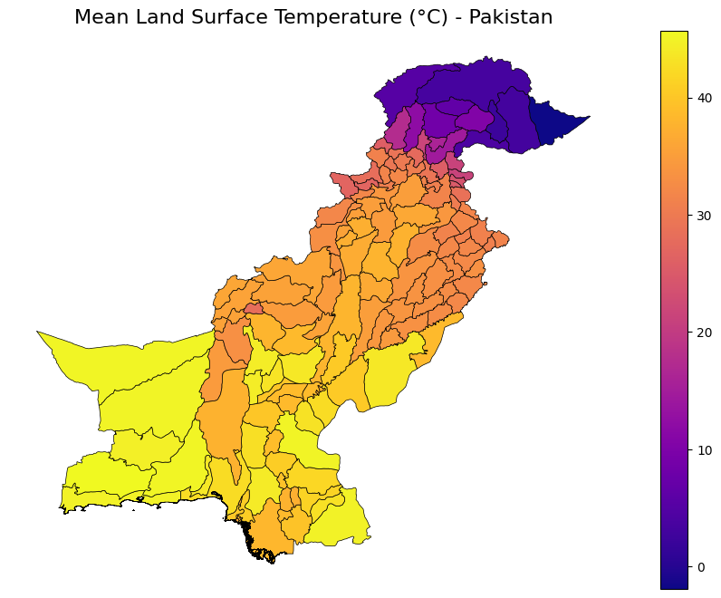
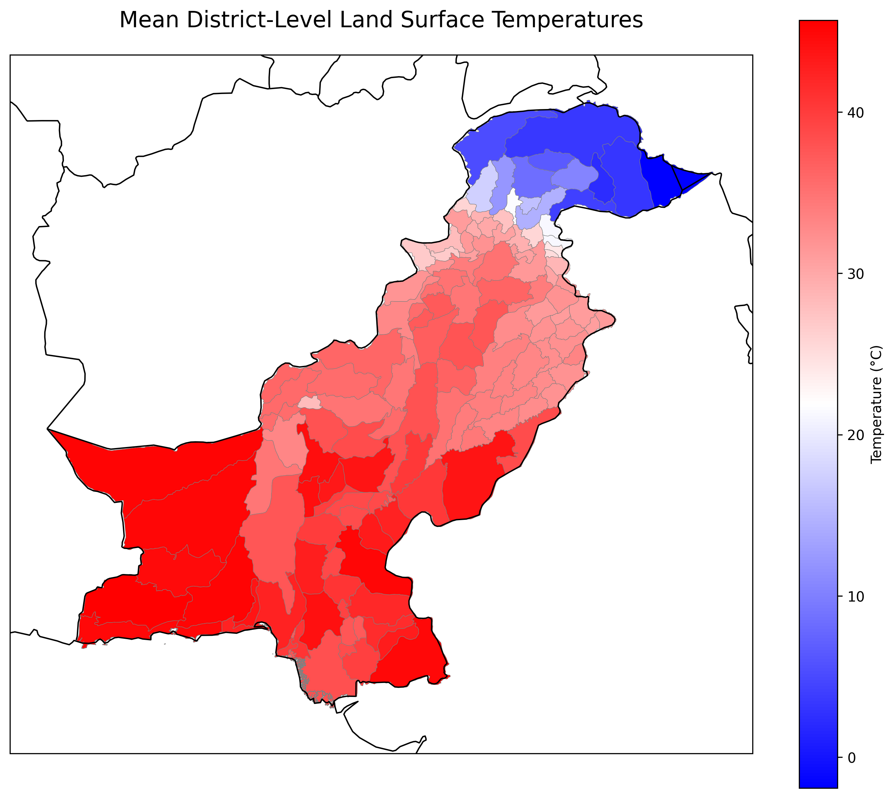
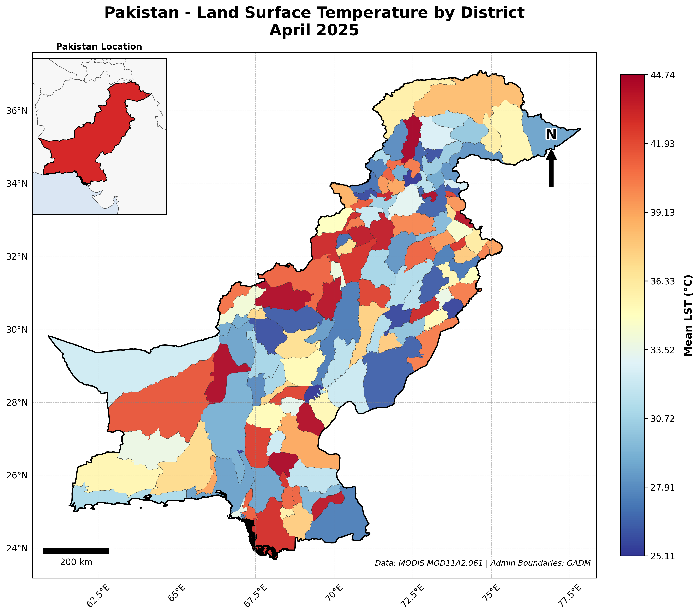
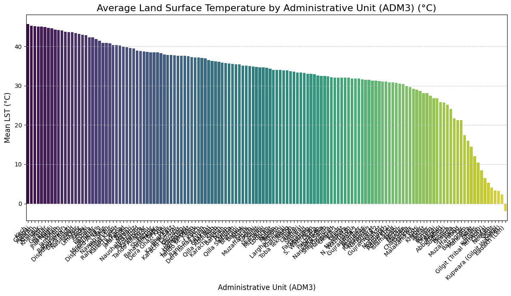
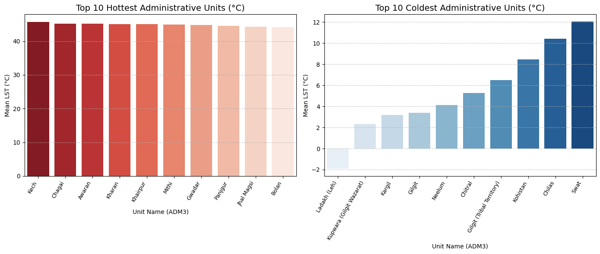
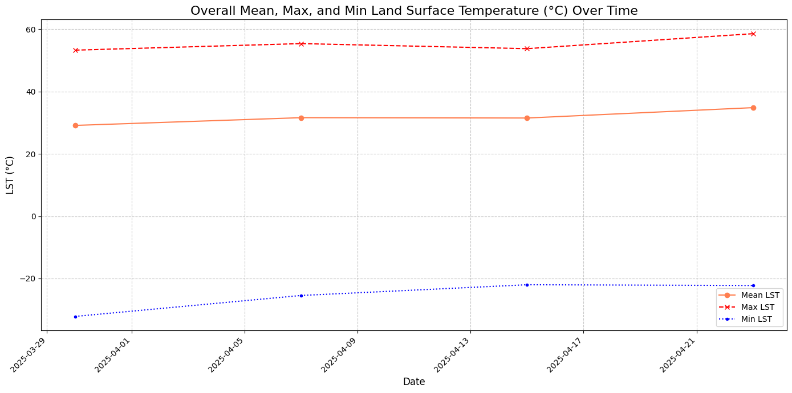
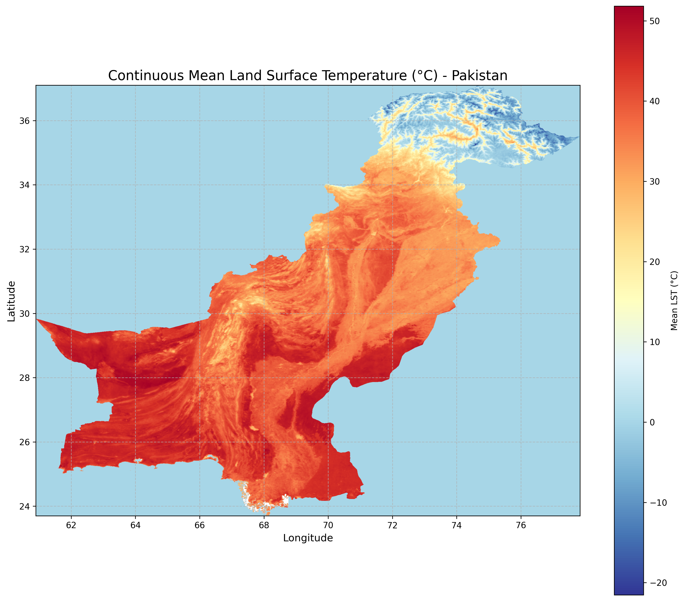

# Pakistan Land Surface Temperature Analysis using MODIS Satellite Data

**Author:** Qandeel Fatima  
**Date:** April–May 2025  
**Course:** Comprehensive Elective Project (CEP)  
**Dataset:** NASA MODIS MOD11A2 v061 | Admin Boundaries: GADM

---

## Overview

This project analyzes **Land Surface Temperature (LST)** across Pakistan for **April 2025** using NASA's MODIS Terra satellite product **MOD11A2** (8-day composite at 1 km resolution). The workflow covers data acquisition via NASA Earthdata, tile mosaicking, raster clipping to Pakistan's boundary, district-level zonal statistics, and a suite of spatial and temporal visualizations.

---

## Project Workflow

```
NASA Earthdata (MOD11A2)
        ↓
  Download MODIS HDF tiles (h23v05, h24v05, h23v06, h24v06 …)
        ↓
  Tile Mosaicking → Mean / Median / Std LST rasters
        ↓
  Reproject to EPSG:4326
        ↓
  Clip to Pakistan boundary (GADM ADM3 shapefile)
        ↓
  Zonal Statistics per District (ADM3)
        ↓
  Visualizations & Analysis
```

---

## Dependencies

Install all required packages with:

```bash
pip install numpy geopandas matplotlib GDAL affine rasterio rasterstats \
            pymodis earthaccess cartopy pyogrio matplotlib-scalebar seaborn
```

| Library | Purpose |
|---|---|
| `earthaccess` | NASA Earthdata authentication & download |
| `GDAL / rasterio` | Raster I/O, mosaicking, reprojection |
| `rasterstats` | Zonal statistics (LST per district) |
| `geopandas` | Shapefile I/O & vector operations |
| `cartopy` | Cartographic projections & map features |
| `matplotlib` | All visualizations |
| `matplotlib-scalebar` | Scale bar on maps |

---

## Data Sources

- **MODIS MOD11A2.061** — 8-day Land Surface Temperature & Emissivity, 1 km, Terra satellite
  - Temporal coverage: 2025-04-01 to 2025-04-30
  - Spatial coverage: Pakistan bounding box (60°–78°E, 23°–38°N)
  - Tiles: h22v05, h23v05, h24v05, h25v05, h22v06, h23v06, h24v06, h25v06
- **GADM Pakistan Level 3** (`gadm41_PAK_3.shp`) — District/Tehsil boundaries (141 features)

---

## Results & Visualizations

### 1. Raw MODIS Tile Mosaic — Mean LST

Mean LST computed across all downloaded tiles covering the South Asia region, before clipping to Pakistan. Temperature range spans from sub-zero (Himalayas/Hindu Kush) to above 50 °C (Thar Desert / Balochistan plains).



> **Date range:** 2025-089 (March 30) to 2025-113 (April 23). The cold blue band running diagonally is the Himalayan and Karakoram mountain arc; the red/orange regions are the Indus plains and Balochistan.

---

### 2. Mean LST per District — Plasma Colormap

District-level mean LST after clipping the raster to Pakistan and computing zonal statistics. The `plasma` colormap highlights the stark contrast between the cold north (KPK, Gilgit-Baltistan) and the hot south/southwest (Sindh, southern Balochistan).



> Northern districts (purple/blue) record mean LSTs well below 10 °C due to glaciated terrain. Southern Sindh and Balochistan (yellow) exceed 40 °C.

---

### 3. District-Level LST — Blue-Red Diverging Map

The same district-level data rendered with a blue–white–red diverging colormap, emphasizing the cold north vs hot south pattern. Districts in Gilgit-Baltistan (deep blue) register the lowest LSTs; Kech, Chagai, and Awaran (deep red) are the hottest.



---

### 4. Cartographic Map — Pakistan LST by District (April 2025)

A publication-quality cartographic map with:
- **Georeferenced districts** colored by mean LST (RdYlBu_r colormap)
- **Gridlines** with latitude/longitude labels
- **Scale bar** (200 km)
- **North arrow**
- **Inset locator map** showing Pakistan's position in South Asia
- Data source attribution



> LST range: **25.1 °C to 44.7 °C** across districts. The highest LSTs are concentrated in Balochistan and southern Sindh, while Gilgit-Baltistan and AJK show the lowest values due to high elevation.

---

### 5. Average LST Ranked by Administrative Unit (ADM3)

A ranked bar chart showing all 141 administrative units (ADM3 level) sorted from hottest to coldest. Each bar is colored using the `viridis` palette.



> **Hottest units:** Kech (~45.7 °C), Chagai (~45.2 °C), Awaran (~45.2 °C)  
> **Coldest units:** Kupwara/Gilgit Wazarat (~2.2 °C), Ladakh/Leh (~−0.8 °C)

---

### 6. Top 10 Hottest & Coldest Administrative Units

Side-by-side bar charts highlighting the extremes:
- **Left (red):** Top 10 hottest districts — dominated by Balochistan (Kech, Chagai, Awaran, Kharan) and southern Sindh (Khairpur, Mithi)
- **Right (blue):** Top 10 coldest districts — dominated by Gilgit-Baltistan (Gilgit, Chilas, Kohistan) and AJK (Neelum, Kargil)



| Rank | Hottest District | LST (°C) | Coldest District | LST (°C) |
|------|-----------------|-----------|-----------------|-----------|
| 1 | Kech | ~45.7 | Ladakh (Leh) | ~−0.8 |
| 2 | Chagai | ~45.2 | Kupwara (Gilgit Wazarat) | ~2.2 |
| 3 | Awaran | ~45.2 | Kargil | ~3.3 |
| 4 | Kharan | ~45.0 | Gilgit | ~3.5 |
| 5 | Khairpur | ~45.0 | Neelum | ~4.1 |

---

### 7. Temporal Trend — Mean, Max & Min LST (April 2025)

A multi-line time series showing how LST evolved across all available MODIS composites during April 2025:
- **Orange (Mean):** National average LST gradually increased from ~30 °C to ~35 °C
- **Red dashed (Max):** Peak temperatures stayed near 53–59 °C throughout, rising slightly toward late April
- **Blue dotted (Min):** Minimum temperatures (glaciated peaks) rose from ~−30 °C toward ~−22 °C



> The upward trend in all three metrics reflects Pakistan's transition from late winter to pre-monsoon summer heating through April.

---

### 8. Continuous LST Heatmap (Raster)

A pixel-level continuous heatmap of the clipped MODIS raster, rendered at 1 km resolution. This bypasses district boundaries and shows raw thermal variation including terrain effects (river valleys, mountain ridges, desert plains).



> The Himalayan/Karakoram arc (top-right, blue) contrasts sharply with the Balochistan plateau and Indus plains (orange/red). River valleys (Indus, Jhelum, Chenab) appear as slightly cooler strips within the plains.

---

## Key Findings

| Metric | Value |
|---|---|
| Study period | April 2025 (8-day MODIS composites) |
| Number of MODIS files downloaded | 24 HDF files |
| Districts analyzed | 141 (GADM ADM3) |
| National mean LST | ~30–35 °C |
| Hottest district | Kech, Balochistan (~45.7 °C) |
| Coldest district | Ladakh/Leh (~−0.8 °C) |
| LST range across Pakistan | ~46 °C spread |

---

## Repository Structure

```
.
├── QANDEEL_CEP_CODE.ipynb    # Main analysis notebook (Google Colab)
├── README.md                  # This file
└── images/
    ├── 01_mean_lst_mosaic_raw.png
    ├── 02_mean_lst_pakistan_district.png
    ├── 03_mean_district_lst_blue_red.png
    ├── 04_pakistan_lst_by_district_april2025.png
    ├── 05_average_lst_by_admin_unit.png
    ├── 06_top10_hottest_coldest_units.png
    ├── 07_lst_temporal_trend.png
    └── 08_continuous_lst_heatmap.png
```

---

## How to Run

1. Open `QANDEEL_CEP_CODE.ipynb` in **Google Colab**
2. Upload the GADM Pakistan Level 3 shapefile components (`gadm41_PAK_3.shp`, `.dbf`, `.shx`, `.prj`, `.cpg`) to `/content/`
3. Enter your **NASA Earthdata** credentials when prompted
4. Run all cells in order

> **Note:** A free NASA Earthdata account is required. Register at [urs.earthdata.nasa.gov](https://urs.earthdata.nasa.gov).

---

## References

- Wan, Z., Hook, S., Hulley, G. (2021). *MODIS/Terra Land Surface Temperature/Emissivity 8-Day L3 Global 1 km SIN Grid V061*. NASA EOSDIS LPDAAC. https://doi.org/10.5067/MODIS/MOD11A2.061
- GADM (2023). *Database of Global Administrative Areas*. https://gadm.org
- earthaccess Python library: https://github.com/nsidc/earthaccess
